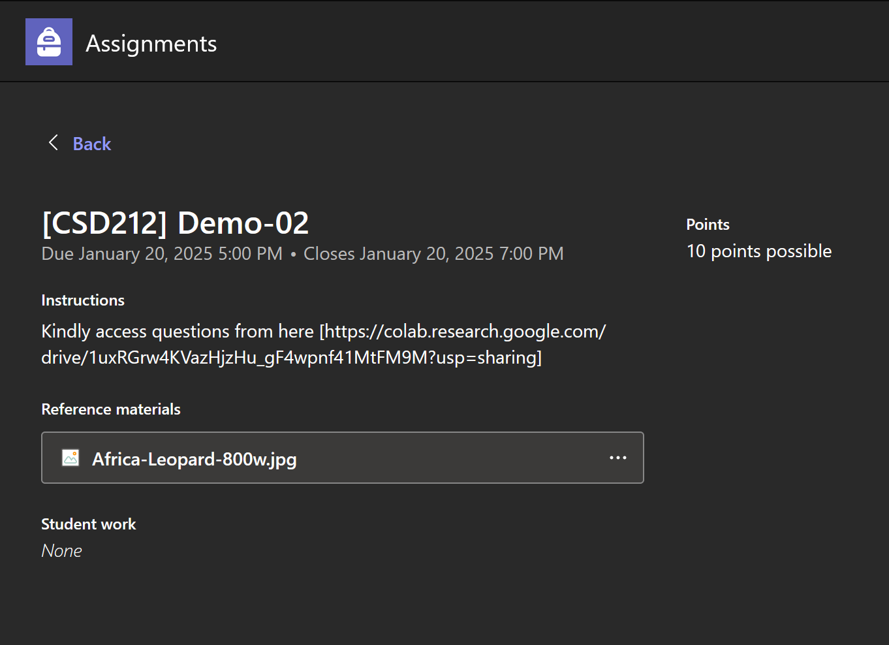
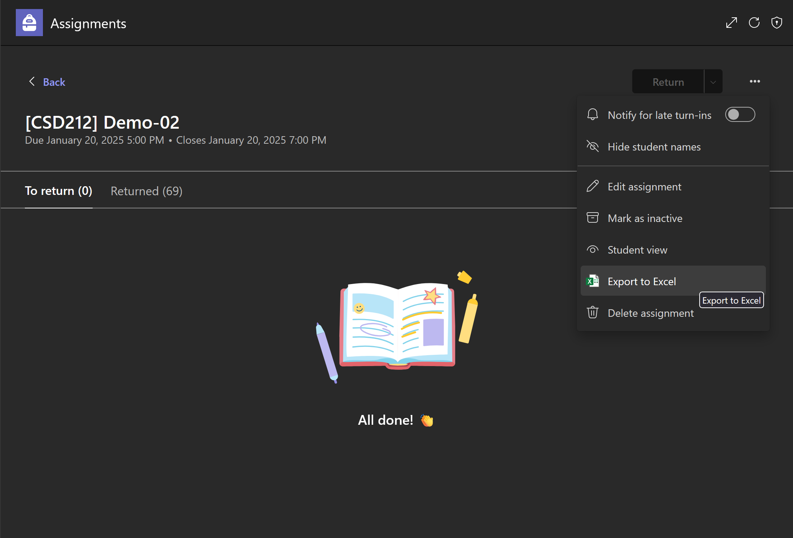
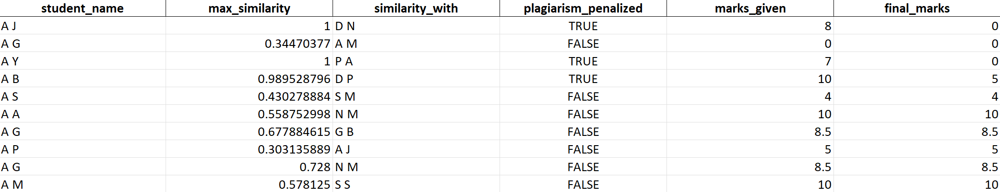

CSD212 Plagiarism Detector
===
A streamlined system to detect code similarities in CSD212 demo submissions and automatically adjust grades based on configurable plagiarism thresholds.

Preprocess (`preprocess.py`)
===
These are the parameters and required input that should be provided before running the module, as well as the expected output after running it.

## Required Input

1. Download student submissions from SharePoint: \
https://snuncr.sharepoint.com/sites/[TEAM_NAME]/Student%20Work/Submitted%20Files \
Replace **[TEAM_NAME]** in the URL with your actual Microsoft Teams group name.
2. Extract to a folder which should result in the following file structure:
   ```
   assignments_folder/
   ├── student_name_1/
   │   ├── assignment_1/
   │   ├── ...
   │   └── assignment_N/
   │       ├── Version 1/
   │       ├── ...
   │       └── Version N/
   │           └── submission_file.ipynb
   ├── ...
   └── student_name_N/
       └── ...
   ```
3.  Download base .ipynb files that are given to students as assignments on Teams and store them in a folder.

## Expected Output

1. Converts all student submissions from .ipynb to .py.
2. Changes file structure to a more usable structure with files separated by demo number:
   ```
   formatted_folder/
   ├── assignment_1/
   │   ├── student_name_1.py
   │   ├── ...
   │   └── student_name_N.py
   ├── ...
   └── assignment_N/
       └── ...

   ```
3. Converts base .ipynb files to .py files with systematic naming.
4. Removes comments and base file code from student submissions to exclude them from plagiarism considerations.

## Parameters

### paths

- `assignments_folder` *(str)*\
   Directory where student submissions downloaded from SharePoint are stored after unzipping.

- `formatted_folder` *(str)*\
   Directory where formatted assignments are to be saved after preprocessing.

- `base_files_folder` *(str)*\
   Directory containing base .ipynb files that are given as assignments.

- `base_output_folder` *(str)*\
   Directory where these base files are to be stored after conversion to .py.

### demos

- Maps demo numbers to their corresponding names and base files.

  - `key` *(int)*\
     The demo number.
  - `demo_name` *(str)*\
     The name of the demo (assignment name) set on Teams.
  - `base_name` *(str)*\
    File name of the demo's base file.



Here, the demo name would be "[CSD212] Demo-02".\
The base name would be the name of the file downloaded from the given link.

Detector (`detector.py`)
===

These are the parameters, input and output for the module. Kindly note that this is to be run individually for each demo.

## Required Input

1. Ensure that preprocessed student assignments are available in the specified folder for the required demo.
2. Export demo grades as Excel file from Teams after returning all of them.



## Expected Output

1. Generates an Excel report with plagiarism scores for each student and their corresponding calculated final grades.
2. Final grades are calculated by penalizing the student's grade in the exported Excel if the plagiarism is above acceptable thresholds.



## Parameters

### paths

- `demo` *(int)*\
   The demo number for which plagiarism detection is being run.

- `preprocessed_assignments_folder` *(str)*\
   Directory where formatted assignments are stored after preprocessing.

- `plagiarism_excel_save_path` *(str)*\
   Path where the plagiarism detection results will be saved as an Excel file.

- `teams_excel_path` *(str)*\
   Path to the exported Teams Excel file containing student grades.

### fingerprint

- `k` *(int)*\
   Length of k-grams to extract as fingerprints.

- `win_size` *(int)*\
   Window size to use for winnowing (must be >= 1).

- `boilerplate` *(list[str])*\
   A list of common lines (e.g., matplotlib calls) and library imports that should be ignored during plagiarism detection.

### plagiarism

- `penalties` *(dict[float, float])*\
   A mapping of plagiarism thresholds to the penalties applied.\
   *(e.g. {0.8: 0.25, 0.9: 0.5} means if plagiarism >= 0.9, 50% of marks are deducted and if 0.9 > plagiarism >= 0.8, 25% of marks are deducted)*

### excel

- `teams_row_start` *(int)*\
   The starting row after headers in the Teams Excel file.

- `teams_name_col` *(str)*\
   The column in the Teams Excel file containing student names.

- `teams_marks_col` *(str)*\
   The column in the Teams Excel file containing student marks.

Configuration
===
All parameters, including demo mappings, boilerplate exclusions, and detection thresholds, are stored in a YAML file (`config.yaml`). Users can modify this file instead of changing code directly.

Contact
===
Email: *[dhruvsharmatheone@gmail.com](mailto:dhruvsharmatheone@gmail.com)*\
Github: *[dtele](https://github.com/dtele)*\
LinkedIn: [Dhruv Sharma](https://www.linkedin.com/in/dhruv-sharma-9b6587309/)

Developed for internal use in CSD212 at Shiv Nadar University.\
If you have any questions or suggestions for improvement, feel free to reach out.
